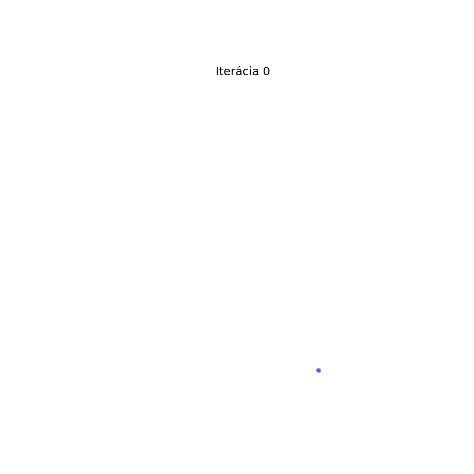
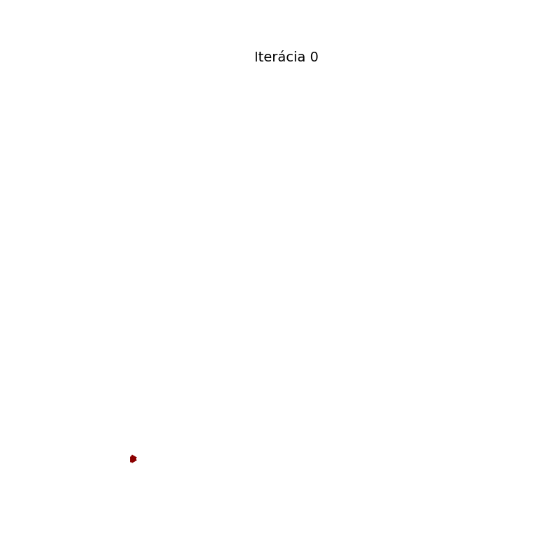
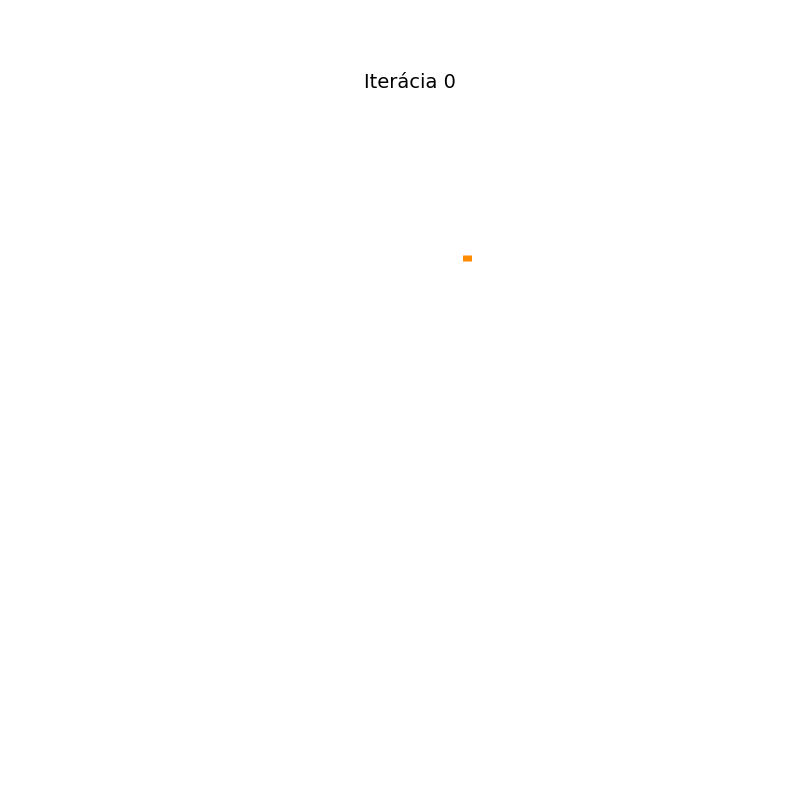
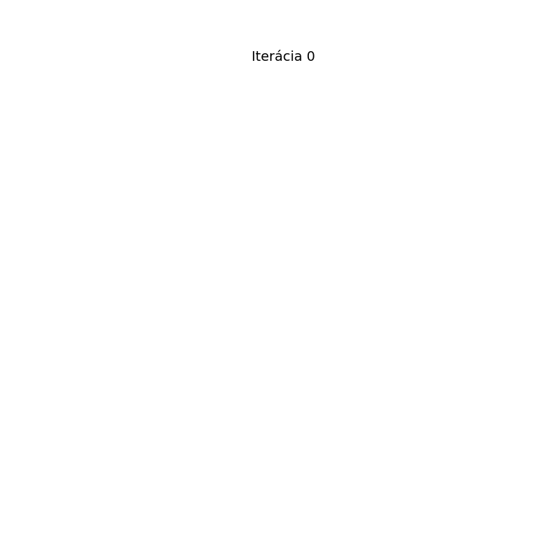
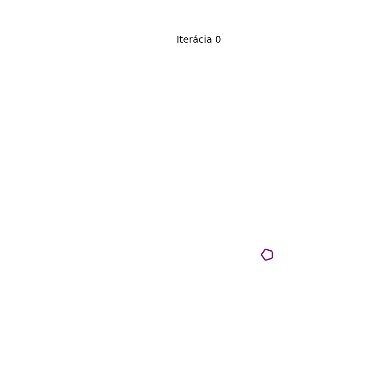
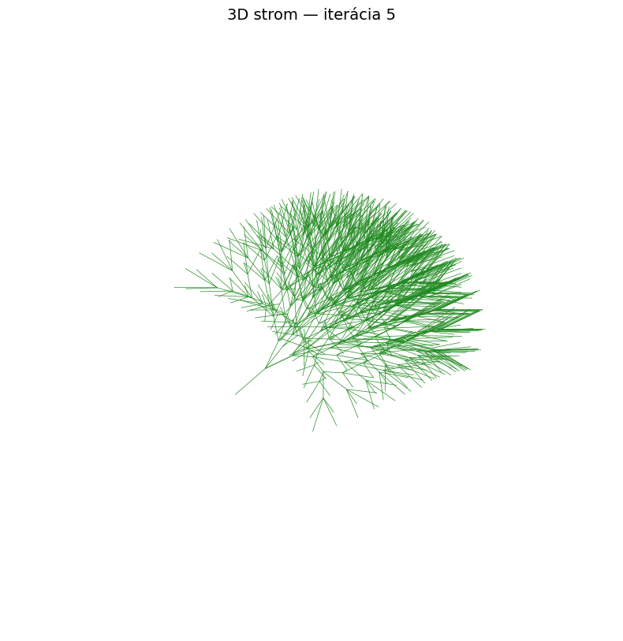

# L-System

A Python implementation of deterministic context-free **D0L-systems** with turtle graphics rendering, GIF animation, and 3D extension.

## Features

- **L-system rewriting engine** — iterative string rewriting based on production rules
- **2D turtle graphics** — full symbol interpretation per the assignment spec (draw, move, turn, push/pop state)
- **GIF animation** — animated development across iterations with adaptive line widths
- **3D extension (bonus)** — turtle graphics in 3D space using Rodrigues' rotation formula, with pitch (`&`, `^`) and roll (`\`, `/`) symbols
- **5 built-in examples** — Koch snowflake, Sierpinski triangle, Dragon curve, Fractal plant, and a custom Pentagonal snowflake
- **Custom L-system** — Pentagonal snowflake: Koch construction applied to a regular pentagon, producing a fractal with 5-fold symmetry

## Turtle Graphics Symbol Table

| Symbols | Interpretation |
|---------|---------------|
| `A`–`U`, `0`–`9` | Draw a line segment in the current heading direction |
| `a`–`u` | Move forward without drawing |
| `V`–`Z`, `v`–`z` | No operation (used as rewriting variables) |
| `+` / `-` | Turn left / right by the predefined angle |
| `\|` | Turn around (180°) |
| `[` | Push current state (position + heading) onto the stack |
| `]` | Pop state from the stack and restore it |
| `&` / `^` | Pitch down / up (3D only) |
| `\` / `/` | Roll left / right (3D only) |

## Installation

```bash
python -m venv .venv
source .venv/bin/activate
pip install -r requirements.txt
```

## Usage

```bash
# Interactive mode — opens matplotlib windows + saves GIFs to output/
python main.py

# Headless mode — saves GIFs without opening windows
python main.py --no-show

# Custom output directory
python main.py --output-dir my_output
```

### Using as a library

```python
from lsystem import Lsystem

# Koch snowflake
Lsystem(
    axiom="F++F++F",
    rules={"F": "F-F++F-F"},
    angle=60,
    iterations=4,
    name="Koch Snowflake",
    save_gif="koch.gif",
)
```

## Examples

### Koch Snowflake (iteration 4)
- **Axiom:** `F++F++F`
- **Rules:** `F → F-F++F-F`
- **Angle:** 60°



### Sierpinski Triangle (iteration 6)
- **Axiom:** `F-G-G`
- **Rules:** `F → F-G+F+G-F`, `G → GG`
- **Angle:** 120°



### Dragon Curve (iteration 12)
- **Axiom:** `FX`
- **Rules:** `X → X+YF+`, `Y → -FX-Y`
- **Angle:** 90°



### Fractal Plant (iteration 6)
- **Axiom:** `X`
- **Rules:** `X → F+[[X]-X]-F[-FX]+X`, `F → FF`
- **Angle:** 25°



### Pentagonal Snowflake — custom (iteration 3)
- **Axiom:** `F+F+F+F+F`
- **Rules:** `F → F-F++F-F`
- **Angle:** 72°
- Koch construction on a regular pentagon instead of a triangle, creating a fractal with pentagonal symmetry.



### 3D Tree — bonus (iteration 5)
- **Axiom:** `A`
- **Rules:** `A → F[+A][-A][&A][^A]`
- **Angle:** 22.5°
- Branches extend in four directions using yaw and pitch rotations.



## Project Structure

```
lsystem/
    __init__.py       — package exports
    core.py           — D0L-system rewriting engine
    turtle2d.py       — 2D turtle interpreter + matplotlib plotting
    turtle3d.py       — 3D turtle interpreter (Rodrigues' rotation)
    animation.py      — GIF animation generator
    lsystem.py        — main Lsystem() function
    examples.py       — built-in L-system definitions
main.py               — demonstration script
requirements.txt      — dependencies
```

## Dependencies

- Python 3.10+
- matplotlib
- numpy
- Pillow
